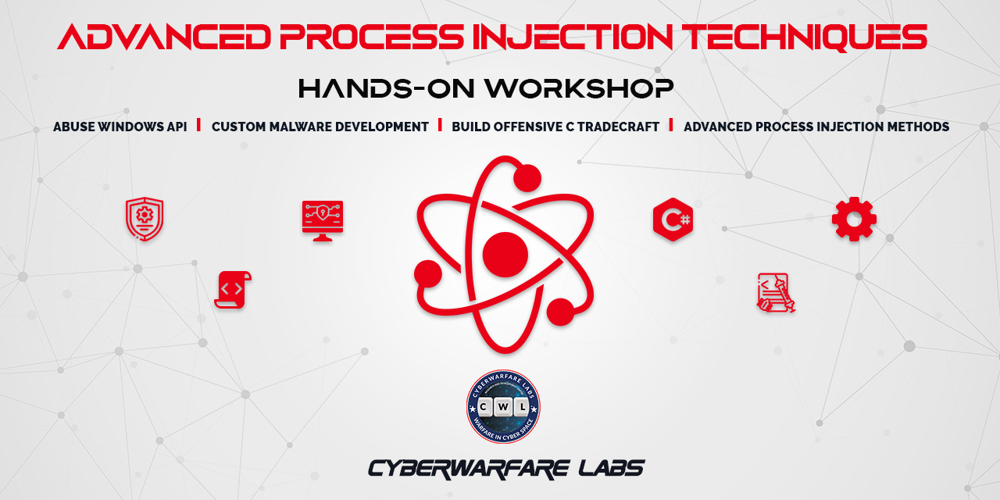

# Advanced-Process-Injection-Workshop by CyberWarFare Labs

To setup the environment, please refer this : https://docs.google.com/document/d/1bNrSDWy-Yc3as2ZlvB_X3XOICUjbGUaKkw9PHDvxNAo

## Tools Used  
PE bear: https://github.com/hasherezade/pe-bear-releases  
CFF Explorer: https://ntcore.com/?page_id=388  
Visual Studio 2022: https://visualstudio.microsoft.com/vs/community/  

# References
1. APC Code Injection  
    https://www.ired.team/offensive-security/code-injection-process-injection/apc-queue-code-injection
2. Module Stomping  
    https://blog.f-secure.com/hiding-malicious-code-with-module-stomping/
    https://github.com/countercept/ModuleStomping
3. Process Hollowing  
    https://github.com/m0n0ph1/Process-Hollowing
4. Process Doppelganging  
    https://github.com/3gstudent/Inject-dll-by-Process-Doppelganging
    https://hshrzd.wordpress.com/2017/12/18/process-doppelganging-a-new-way-to-impersonate-a-process/
5. Transacted Hollowing  
    https://github.com/hasherezade/transacted_hollowing
6. Process Herpaderping  
    https://jxy-s.github.io/herpaderping/
    https://github.com/jxy-s/herpaderping
7. Process Ghosting  
    https://www.elastic.co/blog/process-ghosting-a-new-executable-image-tampering-attack
    https://github.com/hasherezade/process_ghosting
